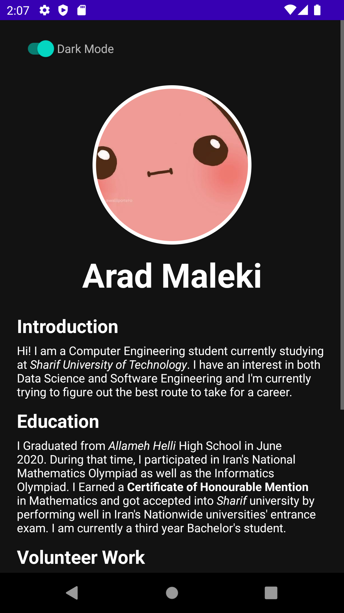
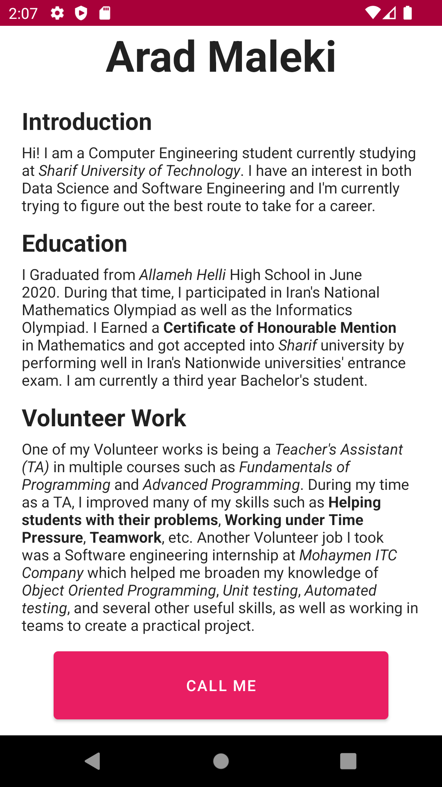

# Mobile-Programming-HW0

This is a simple resume android app written in Java.
You can use the app in the default "Light theme" or toggle the theme button,
as shown below, to switch to "Dark theme".

 

If you scroll all the way down, you can find a "Call me" button which takes you to
the phone call page.

You can change the name shown in the app by changing the <string name="name"> value in "res/values/string.xml" file.

You can change the profile picture in 2 ways:
- replace the image in "res/drawable/pfp.png" with your image
- add your image to the "res/drawable" folder and change the value "@drawable/pfp" in activity_main.xml with "@drawable/ur_pic_name"
